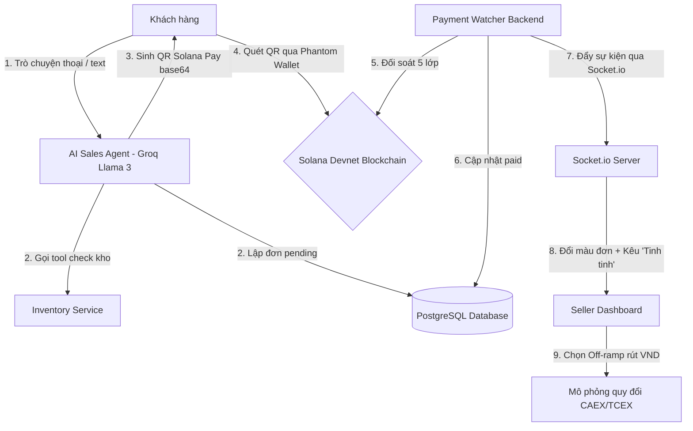

# ShopTalk 💬💸

### *AI Sales Agent cho tiểu thương online - Trải nghiệm mua sắm bằng giọng nói & Thanh toán Solana Pay chớp mắt*

[](https://solana.com)
[](https://www.agora.io)
[](https://groq.com)
[](https://nodejs.org)
[](https://www.postgresql.org)

---

## 📌 Bài toán & Giải pháp (Problem & Solution)

### **Bài toán thực tế** 😭
Các tiểu thương kinh doanh trực tuyến quy mô nhỏ (1-5 nhân sự) đang đối mặt với bài toán vận hành tốn thời gian:
1. **Quá tải CSKH:** Trả lời hàng trăm tin nhắn lặp đi lặp lại về giá, kích thước, số lượng tồn kho. Chatbot truyền thống (ManyChat, Botpress) quá cứng nhắc theo quy tắc dựng sẵn, chỉ cần khách hỏi lệch là báo lỗi.
2. **Thanh toán thủ công phức tạp:** Nhận chuyển khoản ngân hàng xuyên biên giới mất 2-5 ngày với chi phí đắt đỏ. Tại thị trường trong nước, việc gửi ảnh chụp màn hình hóa đơn chuyển khoản ngân hàng giả (Fake Bill) để gian lận ngày càng tinh vi, gây thất thoát doanh thu nghiêm trọng.

### **Giải pháp ShopTalk** 💡
ShopTalk tái định nghĩa thương mại điện tử bằng cách kết hợp **Lớp AI Agent hội thoại** với **Thanh toán Web3 phi tập trung**:
*   Khách hàng có thể gọi điện trực tiếp để tư vấn bằng giọng nói tự nhiên thông qua **Agora Voice Channel** với thời gian phản hồi dưới 1 giây sử dụng mô hình ngôn ngữ lớn chạy trên nền tảng siêu tốc **Groq Cloud**.
*   Khi chốt đơn, AI tự động tạo mã **Solana Pay QR Code** động chuyển thẳng vào ví người bán, xác thực giao dịch on-chain chỉ trong **400ms** với mức phí gần như bằng 0.
*   Chủ shop nhận tiền ngay lập tức, Dashboard tự động nhảy trạng thái thành công (**Paid**) thời gian thực và mô phỏng rút tiền mặt VND về tài khoản ngân hàng thông qua đối tác off-ramp thí điểm (**CAEX/TCEX**).

---

## ⚡ Các tính năng cốt lõi đã hoàn thiện (Core Features)

### 🔊 1. Conversational AI Chat (Hội thoại Voice & Text)
*   **Trải nghiệm rảnh tay:** Tích hợp **Agora Voice Channel** cho phép khách hàng nhấn chọn "Voice Call" và nói chuyện trực tiếp với AI bán hàng.
*   **Tốc độ siêu tốc (<1s):** Sự kết hợp giữa Agora RTC ASR/TTS và **Groq API (`llama-3.3-70b-versatile`)** giúp thời gian sinh văn bản và phản hồi giọng nói đạt mức **dưới 1 giây**, loại bỏ cảm giác chờ đợi gây khó chịu như các AI truyền thống.
*   **Tự động điền đơn (Slot Filling):** AI tự động trích xuất thông tin khách hàng nói (tên, số điện thoại, địa chỉ nhận hàng) để gọi các công cụ lập đơn hàng tự động mà khách không cần điền tay bất kỳ biểu mẫu nào.

### 💳 2. Solana Pay On-chain Payment (Thanh toán Web3 tức thì)
*   **Mã QR Động:** Tự động tạo và đẩy mã QR Solana Pay dạng hình ảnh Base64 trực quan ngay trong khung chat của khách hàng khi chốt đơn.
*   **Xác thực 5 lớp trong 2 giây:** Bộ giám sát giao dịch ngầm `paymentWatcher.js` liên tục truy vấn blockchain qua RPC Solana để xác thực giao dịch qua **5 bước nghiêm ngặt**:
    1.  Trạng thái giao dịch on-chain bắt buộc phải là `confirmed` hoặc `finalized` (chống lỗi fork).
    2.  Mint address khớp chính xác với **USDC Devnet** chuẩn (chống USDC giả mạo).
    3.  Địa chỉ ví đích khớp chính xác ví người bán (`destination == SELLER_WALLET`).
    4.  Số tiền nhận được lớn hơn hoặc bằng giá trị đơn hàng (`amount_received >= expected_amount`).
    5.  Reference key on-chain khớp hoàn toàn mã reference độc bản của đơn hàng (chống trùng lặp giao dịch đồng giá).

### 📊 3. Real-time Merchant Dashboard & Audio Chime (Bảng điều khiển thời gian thực)
*   **Đồng bộ Socket.io:** Khi `paymentWatcher.js` xác nhận giao dịch thành công trên blockchain, backend lập tức bắn tín hiệu WebSocket đến frontend.
*   **Thông báo sống động:** Dashboard của chủ shop lập tức đổi màu đơn hàng sang xanh lá cây, cập nhật tổng số dư USDC, và phát âm thanh chuông **"Tinh Tinh!"** sinh động báo hiệu doanh thu mới mà không cần F5 trang.

### 🛡️ 4. Enterprise Security & RPC Optimization (Bảo mật & Tối ưu hóa RPC)
*   **Cơ chế Idempotency:** Mỗi chữ ký giao dịch (`tx_signature`) chỉ được xử lý đúng một lần duy nhất nhờ ràng buộc unique trong database PostgreSQL, ngăn chặn tuyệt đối lỗi thanh toán trùng do người dùng ấn gửi nhiều lần.
*   **Chống Rate-Limit (429):** Background worker tích hợp cơ chế **Exponential Backoff** và giãn cách truy vấn thông minh đối với Solana RPC, đảm bảo hệ thống vận hành liên tục mà không bị khóa tài khoản RPC khi lưu lượng truy cập cao.

---

## 🛠️ Stack Công nghệ (Tech Stack)

| Thành phần | Công nghệ / Thư viện | Mô tả chi tiết |
| :--- | :--- | :--- |
| **Backend Core** | Node.js, Express | Cung cấp REST API xử lý nghiệp vụ, quản lý đơn hàng và phiên chat |
| **AI Engine** | Groq Cloud, Llama 3.3 70B | Trí tuệ nhân tạo nhận diện ý định, tư vấn và gọi công cụ thông minh |
| **Voice SDK** | Agora RTC, agora-token | Thiết lập phòng đàm thoại voice, truyền phát và mã hóa token RTC |
| **Blockchain** | @solana/web3.js, @solana/pay, @solana/spl-token | Tạo giao dịch Solana Pay, lắng nghe sự kiện on-chain, đối soát token USDC |
| **Database** | PostgreSQL, pg | Lưu trữ dữ liệu đơn hàng, lịch sử chat và các trạng thái phiên |
| **Realtime** | Socket.io, socket.io-client | Giao tiếp thời gian thực hai chiều giữa Client - Server - Dashboard |
| **Frontend Core** | React, Vite, Tailwind CSS | Xây dựng giao diện Responsive, Chat Widget mượt mà cùng hiệu ứng Framer Motion |
| **Charts & Tools** | Recharts, node-cron, bignumber.js | Vẽ biểu đồ Off-ramp tỷ giá, tự động hủy đơn hết hạn và xử lý toán học lớn |

---

## 📐 Kiến trúc hệ thống (System Architecture)

Luồng hoạt động end-to-end từ lúc khách hàng vào shop đến khi rút tiền VND:



---

## 📈 Tiến độ dự án hiện tại (Current Progress)

Chúng tôi đã hoàn thành giai đoạn **Proof of Concept (POC)** hoàn chỉnh bao gồm:
*   [x] **End-to-End Demo:** Luồng đi từ khách hàng chat voice -> Tạo hóa đơn -> Quét QR -> Đổi trạng thái Dashboard -> Rút tiền VND hoạt động hoàn toàn tự động.
*   [x] **Database Migration:** Script [migrate.js](file:///d:/CONVO%20HACKATHON/ShopTalk/backend/src/config/migrate.js) thiết lập cấu trúc DB PostgreSQL chuẩn, tối ưu hóa index tìm kiếm cho đơn hàng và chữ ký giao dịch.
*   [x] **Core Models:** Hệ thống hóa các bảng lưu trữ thông tin sản phẩm, đơn hàng, phiên làm việc (sessions) và lịch sử chat (chat_history).

---

## 🎯 Kế hoạch phát triển tiếp theo (Roadmap)

- [ ] **Hoàn thiện luồng Escalation:** Tự động phát hiện các yêu cầu phức tạp hoặc khiếu nại nhạy cảm từ khách hàng để tạm thời ngắt kết nối AI Bot, lập tức chuyển tiếp cuộc trò chuyện sang cho nhân viên/chủ shop trực tuyến xử lý qua Dashboard.
- [ ] **Đồng bộ kho hàng tự động:** Tích hợp API của các nền tảng quản lý kho phổ biến tại Việt Nam như **Sapo**, **KiotViet** hoặc **Nhanh.vn** để tự động cập nhật tồn kho real-time mà chủ shop không cần chỉnh sửa thủ công.
- [ ] **Tối ưu hóa UI/UX Mobile Widget:** Thiết kế lại khung chat widget cho các thiết bị di động nhỏ gọn, hỗ trợ thao tác vuốt chạm một chạm mượt mà hơn.

---

## 🚀 Hướng dẫn cài đặt nhanh (Quick Start)

### Yêu cầu hệ thống
*   **Node.js** phiên bản v18 trở lên.
*   Cơ sở dữ liệu **PostgreSQL** đang chạy.
*   API key của **Groq** và **Agora**.

### 1. Cấu hình Biến môi trường
Tạo tệp `.env` tại thư mục `/backend` theo mẫu sau:

```env
# Database connection
DATABASE_URL=postgresql://postgres:<your_password>@localhost:5432/shoptalk

# Solana RPC Connection (Devnet)
SOLANA_RPC_URL=https://api.devnet.solana.com
SELLER_WALLET=Bv3n1H1XU2Rz2k2eK1tqJj6Tuxy9rSwP8gM99fKkZpQy

# Groq API Key
GROQ_API_KEY=gsk_your_groq_api_key

# Agora App configurations
AGORA_APP_ID=your_agora_app_id
AGORA_APP_CERTIFICATE=your_agora_app_certificate
AGORA_CUSTOMER_ID=your_agora_customer_id
AGORA_CUSTOMER_SECRET=your_agora_customer_secret

# Order Threshold for escalation (Optional)
ESCALATION_ORDER_THRESHOLD_USDC=100
```

### 2. Các lệnh khởi chạy

#### Bước A: Cài đặt & Khởi động Backend
```bash
# Di chuyển vào thư mục backend
cd backend

# Cài đặt thư viện
npm install

# Khởi chạy database migration tạo bảng
npm run migrate

# Khởi chạy server API & Payment Watcher
npm start
```
*Backend sẽ chạy mặc định tại cổng `http://localhost:3000`.*

#### Bước B: Cài đặt & Khởi động Frontend
```bash
# Mở terminal mới và di chuyển vào thư mục frontend
cd frontend

# Cài đặt thư viện
npm install

# Chạy server phát triển Vite
npm run dev
```
*Frontend sẽ chạy mặc định tại `http://localhost:5173`.*

---

## 👥 Thành viên dự án (Team NopeQi)
*   **Nguyễn Như Quỳnh**
*   **Hồ Nguyễn Thảo Nguyên**
*   **Nguyễn Thị Thanh Phúc**
*   **Tăng Ngọc Hậu**
*   *Mentor hỗ trợ:* **Anh Tuấn**

---
*Dự án được xây dựng và trình bày trong khuôn khổ Cuộc thi Hackathon Convo 2026.*
