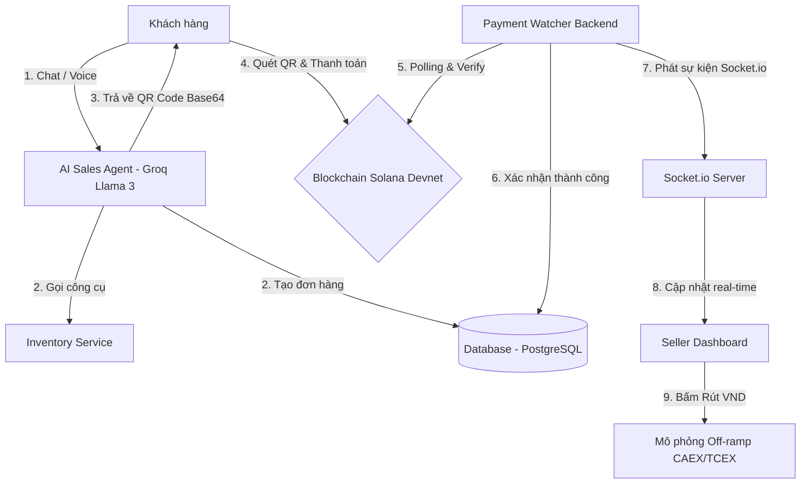

# ShopTalk - Trợ lý bán hàng AI & Tích hợp thanh toán Solana

**ShopTalk** là giải pháp AI Sales Agent đột phá được thiết kế dành riêng cho các tiểu thương bán hàng trực tuyến. Hệ thống kết hợp khả năng tư vấn, chăm sóc khách hàng tự nhiên bằng AI thế hệ mới với công nghệ thanh toán Web3 thông qua cổng thanh toán **Solana Pay**. Giải pháp giúp tự động hóa hoàn toàn quy trình từ khâu tư vấn, kiểm tra tồn kho, tạo đơn hàng, đối soát thanh toán trực tiếp trên Blockchain, cho tới mô phỏng rút tiền về tài khoản ngân hàng Việt Nam (Off-ramp) thời gian thực.

---

## 🌟 Tính năng nổi bật

*   💬 **Trợ lý ảo bán hàng (AI Sales Agent):** Tư vấn sản phẩm, tra kho hàng thời gian thực, tự động lên đơn hàng thông qua cơ chế gọi công cụ thông minh (Tool/Function Calling) của LLM.
*   🔊 **Tích hợp hội thoại Voice (Agora):** Cho phép khách hàng kết nối cuộc gọi thoại trực tiếp với AI Agent thông qua Agora RTC để trải nghiệm mua sắm không chạm.
*   💸 **Thanh toán Solana Pay QR:** Tự động sinh mã QR Code động thanh toán bằng USDC (Devnet), hỗ trợ hiển thị ảnh QR dạng Base64 trực quan ngay trong bong bóng chat.
*   📡 **Đối soát tự động & Real-time Dashboard:** Background worker (`paymentWatcher.js`) liên tục lắng nghe giao dịch trên Solana Devnet. Khi nhận được thanh toán, Dashboard bán hàng của Seller lập tức cập nhật trạng thái sang màu xanh lá cùng âm thanh "tinh tinh" và banner chúc mừng mà không cần tải lại trang (F5).
*   🏦 **Simulated Off-ramp (Rút VND):** Tính năng rút USDC về tài khoản ngân hàng nội địa (như Techcombank, VPBank...) thông qua giao diện quy đổi tỷ giá VND dựa trên mô hình CAEX/TCEX.
*   🔀 **Chuyển tiếp nhân viên hỗ trợ (Escalation):** Tự động phát hiện các từ khóa hoặc yêu cầu nhạy cảm để tạm dừng AI Bot và chuyển cuộc hội thoại cho nhân viên thật chăm sóc.

---

## 🛠️ Stack Công nghệ (Tech Stack)

### 1. Backend Server
*   **Core:** Node.js & Express.
*   **Database:** PostgreSQL (Lưu trữ thông tin sản phẩm, đơn hàng và lịch sử giao dịch).
*   **WebSockets:** Socket.io (Đẩy dữ liệu trạng thái đơn hàng tức thời lên frontend).

### 2. Trí tuệ nhân tạo (AI Engine)
*   **LLM Provider:** Groq Cloud API.
*   **Model:** `llama-3.3-70b-versatile` (Đảm bảo tốc độ xử lý nhanh, khả năng Tool Calling chính xác).

### 3. Blockchain & Web3
*   **Solana Integration:** `@solana/web3.js`, `@solana/pay`, `@solana/spl-token`.
*   **Mạng thử nghiệm:** Solana Devnet.
*   **Token thanh toán:** USDC Devnet (Mint: `4zMMC9srt5Ri5X14GAgXhaHii3GnPAEERYPJgZJDncDU`).

### 4. Giao tiếp Thời gian thực (Voice Channel)
*   **Voice SDK:** Agora RTC (Thông qua thư viện `agora-token` trên backend để xác thực bảo mật).

### 5. Frontend Client
*   **Framework:** React (Vite) + Tailwind CSS + Framer Motion (Xử lý các hiệu ứng chuyển động mượt mà).
*   **Client Socket:** Socket.io-client (Lắng nghe sự kiện cập nhật trạng thái đơn hàng).

---

## 📐 Kiến trúc & Luồng vận hành (System Architecture)

Luồng hoạt động end-to-end của ShopTalk được mô tả qua biểu đồ dưới đây:



1.  **Tương tác:** Khách hàng trò chuyện qua Chat Widget hoặc Voice với AI Agent.
2.  **Xử lý:** AI Agent phân tích câu lệnh, tự động tra cứu danh mục hàng hóa (Inventory) và tạo đơn hàng (Create Order) lưu vào database ở trạng thái `pending`.
3.  **Tạo QR:** Hệ thống sinh mã QR Solana Pay dạng Base64 gửi lại cho khách hàng quét.
4.  **Thanh toán:** Khách hàng sử dụng ví Solana (Phantom, Solflare, v.v.) quét mã QR và ký duyệt giao dịch trên mạng Devnet.
5.  **Xác thực:** Bộ đối soát chạy ngầm `paymentWatcher.js` phát hiện giao dịch khớp với reference của đơn hàng trên blockchain, xác thực số tiền và token hợp lệ.
6.  **Cập nhật:** Đơn hàng chuyển trạng thái sang `paid` trong database và bắn tín hiệu WebSocket.
7.  **Đồng bộ:** Dashboard của người bán cập nhật trạng thái tức thì, phát âm thanh và hiển thị thông báo.
8.  **Rút tiền:** Người bán bấm nút rút tiền, chọn ngân hàng, hệ thống mô phỏng quy trình Off-ramp chuyển đổi USDC thành VND.

---

## ⚙️ Hướng dẫn Cài đặt & Cấu hình

### Yêu cầu hệ thống
*   Đã cài đặt **Node.js** (Phiên bản v18 trở lên).
*   Đã khởi tạo cơ sở dữ liệu **PostgreSQL**.
*   Có tài khoản và API Key của **Groq** và **Agora**.

### 1. Cấu hình biến môi trường
Tạo file `.env` tại thư mục `/backend` của dự án với các cấu hình sau:

```env
# Kết nối Cơ sở dữ liệu PostgreSQL
DATABASE_URL=postgresql://<username>:<password>@localhost:5432/<dbname>

# Cấu hình mạng Solana (Khuyên dùng RPC Devnet hoặc QuickNode/Helius)
SOLANA_RPC_URL=https://api.devnet.solana.com
SELLER_WALLET=Bv3n1H1XU2Rz2k2eK1tqJj6Tuxy9rSwP8gM99fKkZpQy

# Cấu hình AI Sales Agent (API Key từ Groq)
GROQ_API_KEY=gsk_your_groq_api_key_here

# Cấu hình Agora Conversational Voice SDK
AGORA_APP_ID=your_agora_app_id
AGORA_APP_CERTIFICATE=your_agora_app_certificate
AGORA_CUSTOMER_ID=your_agora_customer_id
AGORA_CUSTOMER_SECRET=your_agora_customer_secret
```

---

### 2. Các bước khởi chạy dự án

#### Bước A: Cài đặt và cấu hình Backend
1.  Di chuyển vào thư mục backend:
    ```bash
    cd backend
    ```
2.  Cài đặt các gói thư viện cần thiết:
    ```bash
    npm install
    ```
3.  Chạy migration để khởi tạo cấu trúc bảng cơ sở dữ liệu `orders`:
    ```bash
    npm run migrate
    ```
4.  Khởi chạy máy chủ Backend:
    ```bash
    npm start
    ```
    *Mặc định backend sẽ chạy tại địa chỉ http://localhost:3000.*

#### Bước B: Cài đặt và khởi chạy Frontend
1.  Mở một cửa sổ Terminal mới và di chuyển vào thư mục frontend:
    ```bash
    cd frontend
    ```
2.  Cài đặt các gói thư viện React:
    ```bash
    npm install
    ```
3.  Khởi động server phát triển Vite:
    ```bash
    npm run dev
    ```
    *Mặc định frontend sẽ hoạt động tại địa chỉ http://localhost:5173.*

---

## 🚀 Trạng thái Dự án (Current Status)

Dự án hiện đang ở giai đoạn **POC (Proof of Concept)**:
*   [x] Hoàn thiện khung kết nối và hội thoại thông minh đa lượt với AI Sales Agent qua Groq.
*   [x] Tích hợp thành công Solana Pay sinh QR Code base64 động.
*   [x] Background Worker tự động đối soát on-chain có cơ chế Exponential Backoff chống lỗi Rate Limit (429).
*   [x] Dashboard bán hàng nhận diện cập nhật trạng thái thời gian thực thông qua WebSockets (Socket.io).
*   [x] Giao diện giả lập Off-ramp chuyển tiền từ USDC sang VND đạt độ hoàn thiện cao.
*   [x] Tích hợp cơ chế RTC Token của Agora cho các tính năng voice trong tương lai.
