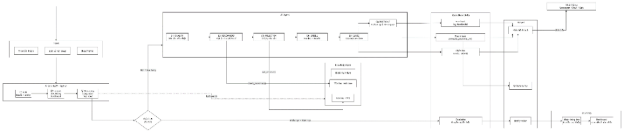
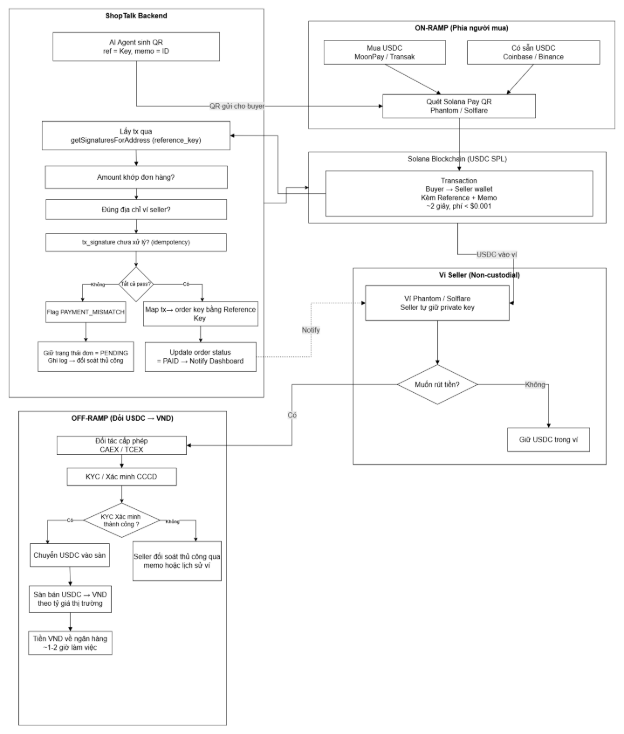
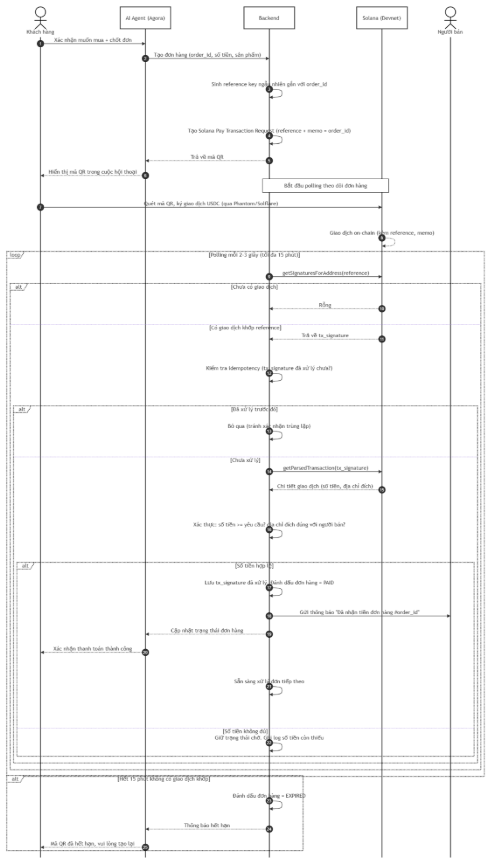

**ShopTalk**

*AI Sales Agent cho tiểu thương bán hàng online, tích hợp thanh toán USDC trên Solana*

|**Nhóm**|NopeQi|
| - | - |
|**Thành viên**|
- Nguyễn Như Quỳnh

- Hồ Nguyễn Thảo Nguyên

- Nguyễn Thị Thanh Phúc

- Tăng Ngọc Hậu
|
|**Mentor**|Anh Tuấn|

1. **Vấn đề**

Tiểu thương bán hàng online trên Facebook/Zalo phải tự trả lời hàng chục tin nhắn lặp đi lặp lại mỗi ngày về giá, size, tồn kho, và dễ bỏ sót đơn hàng vào giờ cao điểm hoặc ban đêm. Các công cụ tự động hóa hiện có (ManyChat, Botpress) hoạt động theo kịch bản cố định: chỉ cần khách diễn đạt câu hỏi khác đi một chút so với kịch bản đã định sẵn là chatbot không thể xử lý chính xác yêu cầu, buộc chủ shop phải quay lại trả lời thủ công cho những tình huống ngoài kịch bản.

1. **Target Customer (Đối tượng khách hàng mục tiêu)**
- **Khách hàng chính:** Chủ shop bán hàng online quy mô nhỏ (1–5 người) trên Facebook/Zalo, có lượng tin nhắn tư vấn đủ lớn khiến việc trả lời thủ công tốn nhiều thời gian, dễ bỏ sót khách hàng hoặc đơn hàng.
- **Nhóm ưu tiên tiếp cận ban đầu:** Các chủ shop có giao dịch với khách hàng hoặc đối tác ở nước ngoài. Ngoài nhu cầu tự động hóa tư vấn bán hàng, nhóm này còn có thể hưởng lợi từ việc thanh toán bằng USDC trên Solana nhờ thời gian xử lý nhanh và chi phí thấp hơn so với một số hình thức thanh toán quốc tế truyền thống. Đây là nhóm phù hợp để thử nghiệm và đánh giá tính khả thi của giải pháp trong giai đoạn đầu.

1. **Giải pháp – Lớp AI Agent (trọng tâm chính)**

Một AI agent đàm thoại — xây trên Agora Conversational AI Engine — được nhúng làm trợ lý chat/voice tùy chọn trên website bán hàng hoặc kênh Messenger/Zalo của chủ shop. Agent sử dụng ngôn ngữ tự nhiên để tương tác với khách hàng, đồng thời có khả năng tự gọi các công cụ (tool) để kiểm tra tồn kho, tạo đơn hàng và khởi tạo yêu cầu thanh toán khi cần thiết. Trong các trường hợp vượt quá phạm vi xử lý hoặc cần sự can thiệp của con người, agent sẽ chuyển cuộc hội thoại sang chủ shop hoặc nhân viên phụ trách. Nếu không có người trực tuyến, agent sẽ thông báo với khách hàng rằng yêu cầu đã được ghi nhận và sẽ được chủ shop phản hồi khi quay lại làm việc.

**Điểm khác biệt so với giải pháp hiện có trên thị trường**

|**Giải pháp**|**Họ làm gì**|**ShopTalk khác gì**|
| :-: | :-: | :-: |
|ManyChat / Botpress|Chatbot rule-based, khớp từ khóa/intent cố định theo kịch bản dựng sẵn|Hiểu ngôn ngữ tự nhiên không giới hạn kịch bản, tự suy luận thay vì chỉ khớp từ khóa; tự gọi tool để tạo đơn + thanh toán ngay trong hội thoại thay vì chỉ trả lời text|
|Chuyển khoản ngân hàng / Western Union cho thanh toán quốc tế|Chuyển tiền quốc tế qua hệ thống ngân hàng truyền thống|Thanh toán USDC qua Solana: xác nhận trong vài giây thay vì 2-5 ngày, phí gần như bằng 0 thay vì 15-30 USD/lần, không cần tài khoản ngân hàng phía người mua|
|Nhân viên CSKH thuê ngoài / part-time|Con người trực tiếp trả lời tin nhắn khách hàng|Hoạt động 24/7 không cần ca trực, chi phí biến đổi theo hoa hồng thay vì lương cố định hàng tháng, vẫn chuyển giao cho người thật khi gặp tình huống vượt khả năng xử lý|

**Chuyển sang người thật – logic phát hiện**

|**Tín hiệu kích hoạt**|**Cách phát hiện**|
| - | - |
|Không đủ thông tin để xử lý|Câu hỏi không khớp với bất kỳ sản phẩm/FAQ nào trong knowledge base ở mức ngưỡng tương đồng nhất định|
|Hỏi lại nhiều lần|Khách diễn đạt lại cùng một câu hỏi từ 2 lần trở lên liên tiếp|
|Từ khóa nhạy cảm|Khiếu nại, hoàn tiền, lỗi sản phẩm, “nói chuyện với người thật”|
|Giá trị đơn hàng cao|Đơn vượt ngưỡng do chủ shop tự cấu hình → cần chủ shop duyệt|

**Dữ liệu tồn kho – giới hạn đã biết**

Hiện tại, AI truy xuất dữ liệu từ một bảng tồn kho đơn giản do chủ shop quản lý trực tiếp. Trong tương lai, hệ thống sẽ tích hợp với các nền tảng quản lý kho như Sapo và KiotViet để đồng bộ dữ liệu tự động.

**Sơ đồ: AI Agent hiểu & hỗ trợ seller (skills tư vấn, ghi nhận feedback, hỗ trợ bán hàng)**

1. **Mô hình kinh doanh**

**Mô hình đề xuất:** Thu phí theo hoa hồng trên giao dịch thành công (khoảng 1–2% trên mỗi đơn hàng được agent xử lý và xác nhận thanh toán thành công), thay vì phí thuê bao cố định hàng tháng.

**Lý do chọn mô hình này:** Tiểu thương quy mô nhỏ rất nhạy cảm về chi phí cố định và thường ngần ngại trả tiền trước khi thấy hiệu quả thực tế. Mô hình hoa hồng đảm bảo chi phí của người bán luôn tỷ lệ thuận với giá trị thực nhận (chỉ trả phí khi có đơn hàng thành công), giúp hạ rào cản dùng thử xuống gần như bằng 0.

**Lợi thế biên lợi nhuận:** Vì phí thanh toán on-chain qua Solana gần như bằng 0, phần lớn hoa hồng thu được là doanh thu thực của sản phẩm, không bị ăn mòn bởi chi phí hạ tầng thanh toán trung gian — đây là điểm khác biệt cấu trúc chi phí so với các giải pháp dùng cổng thanh toán truyền thống (vốn thường mất 2-3% phí giao dịch).

Đây vẫn là giả thuyết ban đầu, mức hoa hồng 1–2% và việc tiểu thương có sẵn sàng chấp nhận mô hình này hay không cần được xác nhận trong giai đoạn phát triển tiếp theo, thông qua phỏng vấn trực tiếp với ít nhất 5–10 chủ shop thuộc nhóm khách hàng mục tiêu

1. **Tích hợp Solana – Luồng thanh toán USDC xuyên biên giới**

Sau buổi review với mentor, nhóm điều chỉnh lại hướng tiếp cận của phần Solana. Thay vì xem Solana chỉ như một lớp xác thực giao dịch, nhóm sử dụng Solana như một kênh thanh toán xuyên biên giới trong luồng demo, với USDC là phương thức thanh toán và bước quy đổi sang VND thông qua các đơn vị trung gian ở cuối quy trình. Trong phạm vi hackathon, giải pháp được xây dựng dưới dạng POC trên Solana Devnet nhằm minh họa tính khả thi của ý tưởng và trải nghiệm người dùng end-to-end, chưa hướng tới một hệ thống production sẵn sàng triển khai trên Mainnet.

**Luồng tổng quan**

- **Bước 1 -** Người mua (trong hoặc ngoài nước) thanh toán đơn hàng bằng USDC trên Solana, thông qua Solana Pay transaction request do AI Agent tạo ra ngay trong hội thoại
- **Bước 2 -** USDC chuyển thẳng vào ví Solana của người bán (chủ shop tại Việt Nam) — xác nhận on-chain trong vài giây, không qua trung gian ngân hàng
- **Bước 3 -** Chủ shop rút USDC sang VND thông qua một đối tác trung gian được pháp luật công nhận, tiền về tài khoản ngân hàng
- Luồng này áp dụng đối xứng cho cả hai chiều: khách quốc tế trả cho người bán Việt Nam, hoặc người bán Việt Nam nhận thanh toán từ đối tác/khách hàng ở nước ngoài

**Vì sao chọn Solana?**

- Tốc độ và chi phí: xác nhận giao dịch trong vài giây, phí gần như bằng 0, so với chuyển khoản quốc tế qua ngân hàng mất nhiều giờ đến vài ngày và chịu phí chuyển đổi ngoại tệ.
- Minh bạch không thể giả mạo: mọi giao dịch được kiểm chứng độc lập trên blockchain — giải quyết trực tiếp tình trạng tranh chấp thanh toán phổ biến giữa người mua và người bán online tại Việt Nam (ảnh chụp màn hình chuyển khoản giả, sai lệch thông tin).
- AI Agent có thể tự xác minh trạng thái thanh toán dựa trên dữ liệu on-chain ngay trong hội thoại, thay vì chờ xác nhận thủ công từ chủ shop.

**On-ramp & Off-ramp**

Theo cách dùng chuẩn của ngành thanh toán số (Mastercard, 2025), on-ramp là bước chuyển đổi từ tiền pháp định (fiat) sang crypto/stablecoin, còn off-ramp là bước chuyển đổi ngược lại, từ crypto/stablecoin về fiat để chi tiêu hoặc rút về tài khoản ngân hàng. Bước “Rút USDC sang VND” trong kiến trúc của ShopTalk chính là một off-ramp, và việc người mua thanh toán bằng USDC tương đương một bước on-ramp đã hoàn tất phía người mua.

- Đây không phải mô hình tự nghĩ ra: các nền tảng thanh toán lớn (Mastercard, qua mạng lưới Mastercard Move và hợp tác với Paxos Global Dollar Network), các sàn giao dịch (Binance, Coinbase), và các dịch vụ ví như MoonPay, Transak đều vận hành theo đúng cấu trúc on-ramp/off-ramp này ở quy mô toàn cầu.
- Theo Mastercard, các dịch vụ on/off-ramp hoạt động dựa trên tích hợp API bảo mật và hệ thống tuân thủ quy định để đảm bảo giao dịch an toàn, thanh toán nhanh, và chống gian lận — đúng nguyên lý kiến trúc “tích hợp với đối tác off-ramp qua API” mà ShopTalk áp dụng.

**Off-ramp: Quy đổi USDC sang VND**

Từ ngày 01/01/2026, Luật Công nghiệp Công nghệ số chính thức có hiệu lực, lần đầu tiên ghi nhận các khái niệm “tài sản số” và “tài sản mã hóa” trong hệ thống pháp luật Việt Nam. Đồng thời, Nghị quyết số 05/2025/NQ-CP ngày 09/09/2025 của Chính phủ đã thiết lập cơ chế thí điểm thị trường tài sản mã hóa trong thời hạn 5 năm nhằm tạo cơ sở cho việc thử nghiệm và hoàn thiện khung quản lý đối với lĩnh vực này.

Theo thông tin công bố, Bộ Tài chính đã tiếp nhận 7 hồ sơ đăng ký tham gia tổ chức thị trường giao dịch tài sản mã hóa, trong đó 5 hồ sơ được đánh giá đầy đủ và hợp lệ, bao gồm **CAEX** (thuộc hệ sinh thái VPBank), **TCEX** (thuộc hệ sinh thái TCBS), cùng VIXEX, LPEX và Công ty Cổ phần Tài sản số Việt Nam. Một số đơn vị trong số này đã tham gia các vòng thẩm định ban đầu theo lộ trình triển khai cơ chế thí điểm.

Trong trường hợp sản phẩm được triển khai thực tế, ShopTalk định hướng tích hợp với các đơn vị off-ramp được cấp phép và hoạt động hợp pháp theo quy định của cơ quan quản lý nhà nước. CAEX và TCEX được đề cập trong báo cáo với vai trò là các ví dụ minh họa về những tổ chức đang tham gia quá trình thẩm định trong khuôn khổ thí điểm, không phải là các đối tác đã ký kết hoặc có thỏa thuận hợp tác với ShopTalk.

**Kiến trúc dự kiến cho production:** sau khi nhận thanh toán bằng USDC, chủ shop có thể thực hiện rút tiền về VND thông qua các đối tác off-ramp được cấp phép. ShopTalk chỉ đóng vai trò tích hợp với các dịch vụ này thông qua API, không trực tiếp thực hiện hoạt động chuyển đổi tài sản số.

**Trong phạm vi POC tại hackathon:** bước off-ramp được mô phỏng bằng tỷ giá giả định nhằm minh họa luồng thanh toán end-to-end. Mục tiêu là chứng minh tính khả thi của trải nghiệm người dùng và khả năng tích hợp, không phải xây dựng hạ tầng quy đổi tài sản số hoàn chỉnh.

**Ranh giới trách nhiệm pháp lý — On-ramp/Off-ramp**

- **ShopTalk chịu trách nhiệm:** sinh QR thanh toán, lắng nghe blockchain, xác thực giao dịch on-chain, cập nhật trạng thái đơn hàng, gửi phản hồi tự động cho người bán và khách hàng
- **ShopTalk tuyệt đối:** không giữ tiền của người dùng, không tự thực hiện quy đổi USDC sang VND, không có quyền truy cập private key của seller
- **Đối tác off-ramp (dự kiến: CAEX, TCEX):** sẽ là đơn vị thực hiện việc quy đổi USDC sang VND và chuyển khoản ngân hàng, khi các đơn vị này chính thức hoàn tất cấp phép thí điểm theo Nghị quyết 05/2025/NQ-CP; nghĩa vụ thuế đối với giao dịch quy đổi này do đối tác kê khai theo hướng dẫn tại Thông tư 32/2026/TT-BTC
- **Mô hình non-custodial:** ShopTalk chỉ lưu trữ địa chỉ ví công khai (public address) của người bán để tạo transaction request, hoàn toàn không chạm vào tài sản hay khóa riêng tư của người dùng
- **Cơ sở pháp lý:** Luật Công nghiệp Công nghệ số (hiệu lực 1/1/2026), Nghị quyết 05/2025/NQ-CP ngày 9/9/2025 của Chính phủ, Quyết định 96/QĐ-BTC, và các Thông tư hướng dẫn của Bộ Tài chính (15/2026, 32/2026, 41/2026/TT-BTC) về kế toán và thuế đối với tài sản mã hóa

**Sơ đồ On-ramp/Off-ramp cho luồng production (bên trung gian, luồng chuyển USDC quốc tế → VN hợp pháp, điểm cần xử lý thủ công)**

1. **Kiến trúc tổng thể**

1. **Sơ đồ luồng thanh toán**

|**1**|
**Khách quốc tế đặt hàng qua chat**

Tương tác với AI Agent qua Messenger/Zalo. Agent xác nhận đơn hàng, kiểm tra tồn kho, tạo yêu cầu thanh toán.
|
| - | :- |
|**2**|
**Agent tạo Solana Pay Request (QR Code)**

Backend sinh transaction request: địa chỉ ví người bán + số tiền USDC + order ID. Trả về mã QR cho khách.
|
|**3**|
**Khách quét QR và thanh toán bằng USDC**

Dùng ví Phantom/Solflare. USDC chạy trực tiếp vào ví Solana của người bán Việt Nam. Giao dịch on-chain, minh bạch.
|
|**4**|
**Backend xác thực giao dịch on-chain**

Hệ thống query Solana RPC: kiểm tra transaction signature, số tiền, địa chỉ ví đích. Nếu hợp lệ → đánh dấu đơn “đã thanh toán”.
|
|**5**|
**Người bán nhận thông báo + rút VND**

Dashboard hiển thị đơn đã xác nhận. Người bán có thể giữ USDC hoặc quy đổi sang VND qua sàn/trung gian hợp pháp (được mô phỏng trong POC).
|

**Sơ đồ minh họa: Luồng end-to-end thanh toán (tạo đơn → QR → quét → listen event → verify → đối soát → cập nhật đơn → gửi thông báo)**

1. **Các lớp kiến trúc**

|**Lớp**|**Thành phần**|**Mô tả**|
| - | - | - |
|Giao diện|Messenger / Zalo / Web Widget|Kênh chat nơi khách tương tác với AI Agent|
|AI Agent|Agora Conversational AI Engine + LLM|Xử lý hội thoại real-time (audio/text), multi-turn context, tool calling; LLM (GPT-4o / Claude 3.5 Sonnet) đóng vai trò suy luận, hiểu ý định và điền thông tin còn thiếu (slot filling), được Agora gọi tới trong pipeline xử lý|
|Knowledge Base|Vector DB (Pinecone / Chroma)|Lưu trữ catalog sản phẩm và FAQ dưới dạng vector, phục vụ RAG để AI Agent truy xuất thông tin theo ngữ nghĩa thay vì khớp từ khóa cố định|
|Thanh toán|Solana Pay + USDC SPL Token|Tạo QR request (@solana/pay), xử lý giao dịch crypto|
|Blockchain|Solana Devnet (POC) / Mainnet (prod)|Ghi nhận giao dịch bất biến, minh bạch|
|Backend|Node.js + Express + Solana Web3.js|REST API xử lý nghiệp vụ, xác thực giao dịch qua RPC (getParsedTransaction), cập nhật trạng thái đơn hàng|
|Realtime|WebSocket|Đẩy cập nhật trạng thái đơn hàng tới Dashboard và AI Agent ngay khi giao dịch được xác thực|
|Database|PostgreSQL|Lưu trữ orders, lịch sử giao dịch, idempotency keys|
|Quy đổi|Trung gian hợp pháp (mô phỏng trong POC)|Đổi USDC → VND qua sàn được cấp phép thí điểm|

**Bảng dưới đây cụ thể hóa từng lớp kiến trúc ở trên bằng công nghệ/thư viện thực tế sẽ sử dụng.**

1. **Stack kỹ thuật**

|**Lớp**|**Công nghệ**|**Vai trò**|
| - | - | - |
|AI Engine|Agora Conversational AI Engine|Real-time voice/text, tool calling, multi-turn context|
|LLM|GPT-4o / Claude 3.5 Sonnet|Reasoning, intent detection, slot filling|
|Vector DB|Pinecone / Chroma|RAG — Knowledge base cho AI|
|Backend|Node.js + Express|REST API + WebSocket server|
|Blockchain SDK|Solana Web3.js v1.x|RPC calls, transaction parsing, verify|
|Payment|@solana/pay v0.2.x|Tạo transaction request URL + QR code|
|Token|USDC SPL Token (Devnet / Mainnet)|Stablecoin thanh toán|
|Database|PostgreSQL|Orders, transactions, idempotency keys|
|Realtime|WebSocket|Dashboard cập nhật real-time|

1. **Cơ chế phân biệt giao dịch đồng thời (Multi-transaction Mapping)**

**Vấn đề:** Khi nhiều khách chuyển USDC cùng lúc vào cùng một ví seller, đôi khi với cùng một số tiền, hệ thống không thể phân biệt các giao dịch chỉ dựa vào amount. Giải pháp sử dụng kết hợp hai cơ chế: **reference** (xác thực chính, máy đọc, không thể giả mạo) và **memo** (lớp dự phòng cho con người đọc khi cần đối soát thủ công), cùng với idempotency và timeout để đảm bảo hệ thống xử lý đúng và an toàn.

**1. Reference — cơ chế xác thực chính**

Mỗi Solana Pay QR sinh ra một public key ngẫu nhiên, duy nhất, gắn riêng cho order\_id đó. Solana Pay bắt buộc đính kèm reference key này vào transaction on-chain — không thể giả mạo, không thể tách rời khỏi giao dịch. Backend gọi getSignaturesForAddress(reference\_key) để lấy chính xác giao dịch của đơn hàng đó, verify số tiền, rồi đánh dấu đơn là PAID.

**2. Memo — lớp dự phòng cho con người**

QR cũng đính kèm thêm memo chứa order\_id (ví dụ: "Thanh toán đơn ORD-001"). Khi khách quét mã bằng ví Phantom, họ đọc được dòng chữ này và yên tâm khi chuyển tiền. Trong trường hợp hệ thống tự động gặp sự cố, chủ shop vẫn có thể mở lịch sử giao dịch trên ví, đọc memo, và đối soát bằng tay.

**Lưu ý:** memo không được dùng làm cơ chế xác thực kỹ thuật chính, vì một số ví không đảm bảo hiển thị hoặc giữ nguyên memo đúng chuẩn. Reference mới là cơ chế xác thực bắt buộc và đáng tin cậy; memo chỉ đóng vai trò hỗ trợ con người khi cần kiểm tra thủ công.

**3. Idempotency**

Mỗi tx\_signature chỉ được xử lý một lần. Trước khi cập nhật trạng thái đơn hàng, hệ thống kiểm tra xem signature này đã được xử lý trước đó chưa (lưu trong database với ràng buộc unique), để tránh trường hợp một giao dịch bị xác nhận hai lần (ví dụ do retry mạng hoặc job chạy lại).

**4.** **Cơ chế lắng nghe giao dịch**

Ở giai đoạn POC, backend sử dụng polling: gọi getSignaturesForAddress(reference) định kỳ mỗi 2–3 giây cho từng đơn đang chờ thanh toán. Đây là lựa chọn phù hợp cho quy mô demo, đơn giản và dễ triển khai trong thời gian ngắn. Ở giai đoạn production, hệ thống có thể nâng cấp lên WebSocket subscription (connection.onLogs(reference, callback)) để nhận thông báo ngay khi có giao dịch, giảm tải RPC calls và tăng tốc độ phản hồi.

**5. Xử lý sai số tiền**

Nếu khách quét đúng QR (đúng reference) nhưng chuyển sai số tiền, hệ thống áp dụng quy tắc: chỉ chấp nhận giao dịch nếu số tiền nhận được lớn hơn hoặc bằng số tiền yêu cầu; từ chối và giữ trạng thái đơn ở mức chờ nếu số tiền chuyển thiếu.

**6. Timeout đơn hàng**

Mỗi đơn hàng có thời gian chờ thanh toán giới hạn (ví dụ 15 phút) kể từ khi QR được tạo. Nếu không nhận được giao dịch khớp reference trong khoảng thời gian này, đơn hàng tự động chuyển sang trạng thái hết hạn, giúp backend không phải poll vô thời hạn cho các đơn đã bị khách bỏ dở.

1. **Cơ chế Verify On-chain và Gửi phản hồi tự động**

**Tóm tắt luồng xử lý**

1. Tạo **reference** — một public key ngẫu nhiên, duy nhất, gắn với order\_id ngay khi chốt đơn; QR encode địa chỉ ví nhận, số tiền, mint address của USDC, và reference này
1. Backend (worker) lắng nghe trực tiếp blockchain — không tin tín hiệu "đã thanh toán" do client tự báo
1. Khi bắt được giao dịch mới, lấy chi tiết qua getParsedTransaction(tx\_signature) và kiểm tra **5 điều kiện bắt buộc**: 
   1. Giao dịch ở trạng thái confirmed/finalized, không phải pending
   1. Đúng loại token: mint address khớp USDC chính thức (chống token giả mạo)
   1. destination == seller\_wallet\_address
   1. amount\_received >= expected\_amount
   1. reference khớp với reference đã lưu cho đơn hàng đó
1. Kiểm tra idempotency: tx\_signature chưa từng được xử lý trong DB
1. Nếu cả 5 điều kiện đều đạt → dùng reference tra ngược order\_id, cập nhật order.status = PAID (có cơ chế lock chống ghi đè khi nhiều worker xử lý cùng lúc)
1. Gửi phản hồi tự động cho seller qua API kênh chat tương ứng (Messenger/Zalo), đồng thời đẩy cập nhật real-time lên dashboard qua WebSocket
1. Nếu một trong 5 điều kiện không đạt → từ chối toàn bộ, ghi log cảnh báo, giữ đơn ở trạng thái chờ để đối soát thủ công

**Giải thích chi tiết từng giai đoạn**

**Giai đoạn 1 — Tạo định danh trước khi nhận tiền**

Khi AI chốt đơn, hệ thống không chỉ tạo order\_id thông thường, mà sinh thêm một reference theo chuẩn Solana Pay — một public key ngẫu nhiên (không phải ví thật, chỉ dùng để định danh), gắn duy nhất cho đơn hàng đó. Bản ghi lưu vào database theo cấu trúc: reference → order\_id, amount, wallet, status: pending. QR hiển thị cho khách encode 4 thông tin: địa chỉ ví nhận của doanh nghiệp, số tiền cần trả, mint address của USDC (để ví khách biết phải trả bằng đúng token nào), và reference. Đây là bước chuẩn bị bắt buộc — nếu không gắn reference từ đầu, hệ thống sẽ không có cách nào phân biệt giao dịch nào trả cho đơn nào khi nhiều khách thanh toán cùng lúc.

**Giai đoạn 2 — Lắng nghe blockchain, không tin lời báo của client**

Nguyên tắc quan trọng nhất: hệ thống tuyệt đối không đánh dấu đơn hoàn tất chỉ vì ứng dụng phía khách gửi tín hiệu "tôi đã thanh toán" — tín hiệu đó hoàn toàn có thể bị giả mạo hoặc gửi sai. Thay vào đó, một backend worker độc lập chạy liên tục, subscribe trực tiếp vào địa chỉ ví doanh nghiệp trên Solana qua RPC (getSignaturesForAddress) hoặc WebSocket (onLogs). Worker này là "tai mắt" duy nhất được tin tưởng, vì đọc dữ liệu trực tiếp từ chain, không qua trung gian nào có thể bị can thiệp. Khi có giao dịch mới, worker bắt sự kiện gần như ngay lập tức và đưa vào hàng đợi xử lý.

**Giai đoạn 3 — Verify: năm điều kiện bắt buộc, thiếu một là từ chối toàn bộ**

Đây là điều kiện cứng, không phải gợi ý — chỉ khi cả năm đều đúng mới được coi là hợp lệ:

- *Trạng thái xác nhận:* giao dịch phải confirmed hoặc finalized, không phải pending — vì giao dịch pending có thể bị fork hoặc revert, tin ngay sẽ dẫn đến đánh dấu đơn đã trả tiền trong khi thực tế chưa chắc chắn xảy ra.
- *Đúng loại token:* kiểm tra mint address của token được chuyển có khớp USDC chính thức không — phòng chống kẻ gian tạo token giả có cùng tên, cùng icon "USDC" nhưng khác mint address, gửi số lượng lớn để đánh lừa hệ thống verify hời hợt.
- *Đúng địa chỉ đích:* xác nhận tiền chuyển đến đúng ví doanh nghiệp đã đăng ký, không phải ví trung gian hay ví nào khác trông giống.
- *Đủ số tiền:* số USDC nhận được phải bằng hoặc lớn hơn số tiền đơn hàng yêu cầu; nếu thiếu, không coi đơn là đã thanh toán.
- *Đúng reference:* bước đối soát cốt lõi — đọc trường reference đính trong giao dịch, so khớp với reference đã lưu ở Giai đoạn 1 để xác định chính xác giao dịch thuộc đơn hàng nào.

Nếu một trong năm điều kiện không thỏa, giao dịch bị từ chối hoàn toàn, hệ thống ghi log cảnh báo gửi cho team kỹ thuật.

**Giai đoạn 4 — Đối soát và cập nhật trạng thái**

Khi giao dịch đã qua verify, hệ thống dùng reference để tra ngược trong database, lấy ra order\_id và seller\_id tương ứng — bảng dữ liệu được đánh index theo reference nên tra cứu diễn ra gần như tức thì dù số đơn xử lý cùng lúc lớn. Sau đó cập nhật order.status = paid, sử dụng cơ chế lock (database transaction lock hoặc optimistic locking) để đảm bảo nếu nhiều worker cùng chạm vào một đơn hàng tại cùng thời điểm (dễ xảy ra khi traffic cao), sẽ không có hai cập nhật ghi đè lẫn nhau dẫn đến trạng thái sai hoặc thông báo trùng lặp.

**Giai đoạn 5 — Gửi phản hồi tự động cho seller**

Ngay sau khi cập nhật trạng thái, hệ thống gọi API kênh chat tương ứng — Messenger Send API hoặc Zalo OA API — gửi kèm mã đơn hàng, số tiền đã nhận, thông tin khách mua. Có hai nhánh xử lý:

- *Gửi thành công:* đồng thời đẩy cập nhật lên dashboard real-time của seller (WebSocket hoặc polling), để chủ shop thấy đơn mới ngay trên màn hình quản lý, không chỉ phụ thuộc vào tin nhắn.
- *Gửi thất bại* (API rate limit, mất kết nối tạm thời, token hết hạn...): hệ thống retry với backoff tăng dần (5 giây → 30 giây → 2 phút) để tránh làm nghẽn API đang gặp sự cố. Nếu vẫn thất bại sau các lần retry, đơn hàng được đẩy vào hàng đợi cảnh báo riêng, đảm bảo seller vẫn có thể chủ động vào dashboard kiểm tra và xác nhận thủ công — nguyên tắc là không để thông báo bị mất âm thầm.
  1. **Quản lý ví**
- Trong phạm vi POC: ví Solana của người bán (chủ shop) do chính chủ shop tự tạo và tự quản lý private key (qua Phantom/Solflare) — ShopTalk không lưu trữ hay kiểm soát khóa riêng tư của người bán
- Backend chỉ lưu địa chỉ ví công khai (public address) của người bán để sinh transaction request, không có quyền truy cập hay di chuyển tài sản trong ví

Đây là mô hình non-custodial: giảm rủi ro pháp lý và bảo mật cho giai đoạn POC, vì ShopTalk không bao giờ trực tiếp giữ tiền của người dùng

1. **Tốc độ hệ thống**

Các con số dưới đây là thời gian dự kiến, ước lượng dựa trên thông số kỹ thuật công bố của Solana và Agora Conversational AI Engine — chưa phải số đo thực tế từ hệ thống chạy. Khi có POC hoạt động, các số liệu này sẽ được cập nhật bằng dữ liệu đo thật từ demo.

|**Bước**|**Thời gian**|**So sánh**|
| :-: | :-: | :-: |
|AI xử lý intent + reply|< 1 giây|—|
|Sinh Solana Pay QR|< 100ms|—|
|**Solana xác nhận giao dịch on-chain**|**~400ms**|Wire transfer ngân hàng: 1-3 ngày|
|Backend xác thực giao dịch (verify on-chain)|< 500ms|—|
|WebSocket đẩy thông báo tới Dashboard|< 50ms|—|
|**Tổng: từ lúc khách thanh toán → người bán nhận thông báo**|**~1-2 giây**|SWIFT quốc tế: 1-3 ngày + phí 3-5%|

Khoảng cách tốc độ này chính là lý do cốt lõi khiến Solana tạo ra giá trị thật cho ShopTalk, không chỉ ở mức ý tưởng: một giao dịch xuyên biên giới hoàn tất trong vài giây thay vì vài ngày, giúp người bán xác nhận và xử lý đơn hàng gần như tức thì.

1. **Reset Scenario** 

Đây là các tình huống hệ thống không đi theo đường xử lý lý tưởng, cần quy tắc xử lý rõ ràng để đảm bảo không có đơn hàng nào bị treo vô thời hạn hoặc xác nhận sai.

|**Tình huống**|**Cách xử lý**|
| :-: | :-: |
|Giao dịch đang chờ xác nhận quá 30 giây|Cập nhật giao diện hiển thị "Đang chờ xác nhận lâu hơn bình thường" cho khách — đây là ngưỡng cảnh báo UX, không thay đổi tần suất polling nền của backend (vẫn poll đều mỗi 2–3 giây)|
|Số tiền nhận được không khớp số tiền yêu cầu|Gắn nhãn PAYMENT\_MISMATCH, giữ đơn ở trạng thái chờ, cảnh báo chủ shop kiểm tra và đối soát thủ công|
|Giao dịch on-chain không mang reference key|Gắn nhãn UNMATCHED\_TX — xảy ra khi khách chuyển tiền trực tiếp vào ví seller mà không quét QR/đi qua app (không có reference key đính kèm); chủ shop tự đối soát thủ công qua memo hoặc lịch sử ví|
|Hết 15 phút không phát sinh giao dịch khớp|Đơn chuyển trạng thái PAYMENT\_EXPIRED, thông báo cho khách hàng để thử thanh toán lại|
|Giao dịch đã confirm on-chain nhưng hệ thống/DB gặp lỗi khi ghi nhận|Xử lý lại an toàn nhờ cơ chế idempotency (kiểm tra tx\_signature đã tồn tại trong DB chưa) trước khi ghi nhận lại, tránh xác nhận trùng|

1. **Luồng demo (devnet)**
- Agent xác nhận đơn hàng trong hội thoại → tạo Solana Pay transaction request (mã QR) cho người mua
- Ví demo (Phantom/Solflare, devnet) quét và thanh toán bằng USDC thử nghiệm → tiền vào ví Solana của chủ shop
- Backend xác thực giao dịch on-chain, đánh dấu đơn đã thanh toán, cập nhật dashboard chủ shop theo thời gian thực
- Dashboard hiển thị nút “Rút về VND” minh họa bước quy đổi qua đối tác trung gian (mô phỏng tỷ giá cho mục đích demo)
